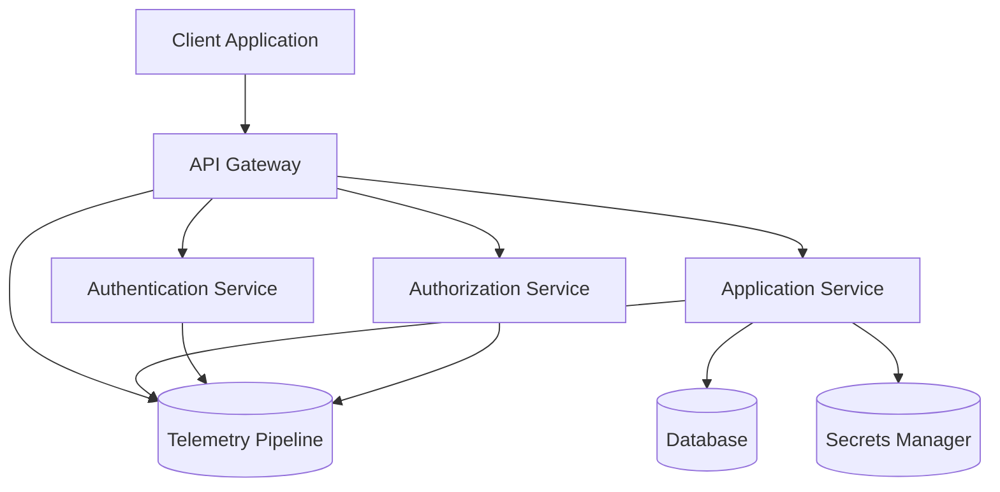

# API Platform Data Flow Diagram

## Overview

This diagram represents a typical secure API platform architecture.

External clients interact with the platform through an API Gateway, which performs authentication and authorization checks before forwarding requests to internal application services.

Application services access backend resources such as databases and secrets management systems.

Security telemetry is generated across multiple components to support monitoring, detection, and incident investigation.

## Key Trust Boundaries

| Boundary                              | Description                         |
| ------------------------------------- | ----------------------------------- |
| Client → API Gateway                  | External access to platform         |
| API Gateway → Internal Services       | Gateway forwards validated requests |
| Application Service → Database        | Access to stored data               |
| Application Service → Secrets Manager | Retrieval of credentials            |

## Security Considerations

* Authentication must be enforced at the gateway layer
* Authorization must be validated before accessing services
* Backend services should validate tokens independently
* Telemetry should capture authentication, authorization, and service activity
