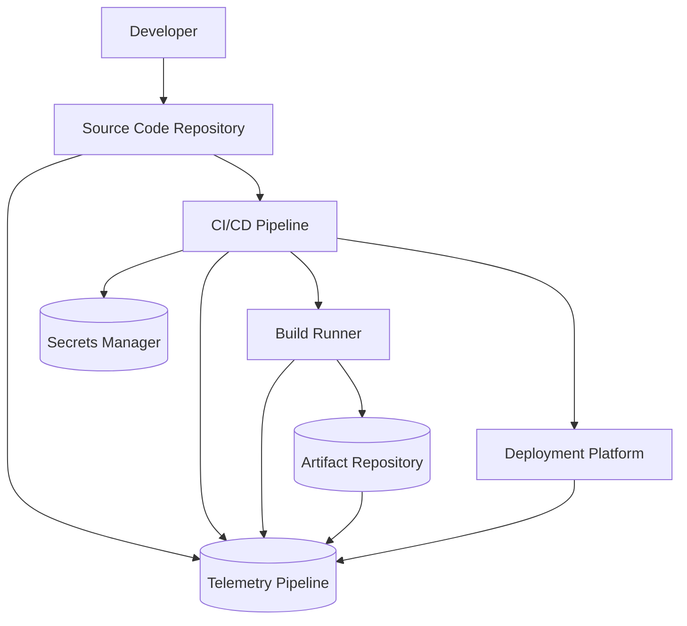

# CI/CD Pipeline Data Flow Diagram

## Overview

This diagram represents a CI/CD pipeline used to build and deploy software.

Developers commit code to a repository, which triggers automated pipeline workflows that compile, test, package, and deploy applications.

Because CI/CD pipelines often have privileged access to source code, credentials, and deployment systems, they represent a critical component of the software supply chain.

## Key Trust Boundaries

| Boundary                       | Description                    |
| ------------------------------ | ------------------------------ |
| Developer → Source Repository  | Code commits and pull requests |
| Repository → CI/CD Pipeline    | Pipeline execution triggered   |
| Pipeline → Build Runner        | Build job execution            |
| Pipeline → Deployment Platform | Application deployment         |

## Security Considerations

* Pipeline configuration must be protected from unauthorized modification
* Secrets used during builds must be securely managed
* Artifact integrity should be validated before deployment
* Pipeline execution must be logged and monitored
