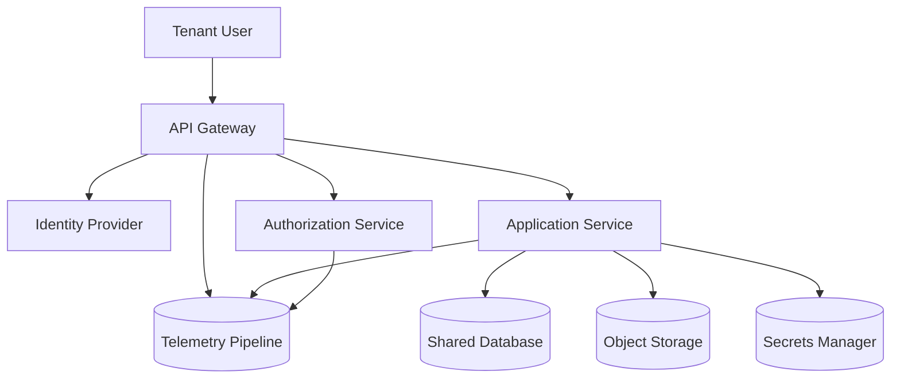

# SaaS Tenant Isolation Data Flow Diagram

## Overview

This diagram represents a multi-tenant SaaS architecture.

Multiple tenants share application infrastructure while logical isolation mechanisms ensure that tenant data and operations remain separated.

Tenant identity is verified through an identity provider and authorization service before application services process requests.

## Key Trust Boundaries

| Boundary                              | Description               |
| ------------------------------------- | ------------------------- |
| Tenant User → API Gateway             | External tenant traffic   |
| API Gateway → Application Services    | Tenant request processing |
| Application Service → Shared Database | Tenant data access        |
| Application Service → Object Storage  | Tenant file storage       |

## Security Considerations

* Tenant identity must be propagated across the entire request flow
* Authorization checks must enforce tenant ownership
* Shared infrastructure must prevent cross-tenant access
* Telemetry must include tenant context for investigation
